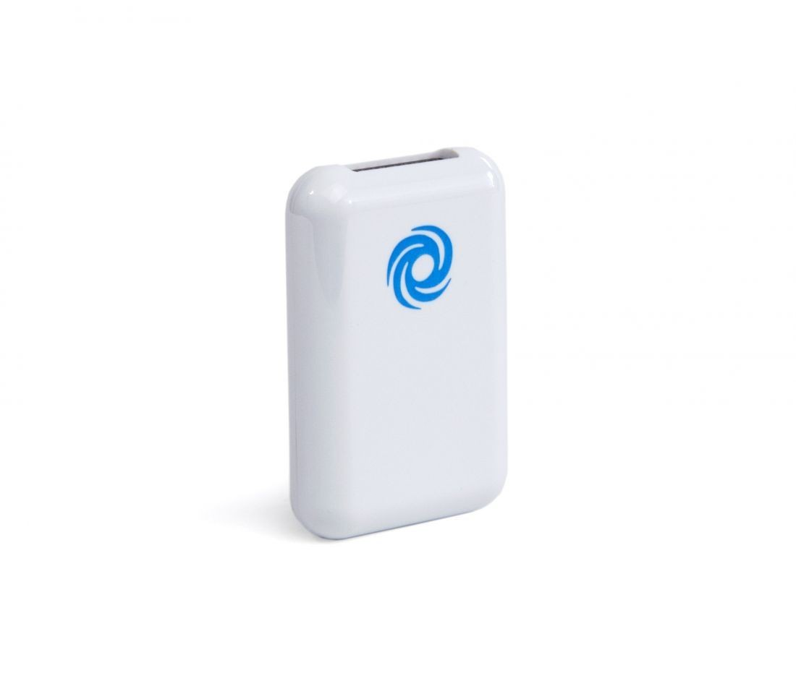

## Three things you should know about ionic air purification

From the air we breathe to the water we drink, we depend on our environment for our health. Here we will answer three common questions about air quality, starting with one about personal ionic air purifiers, which are devices you can wear around your neck to improve the air quality for yourself.

I see other people wearing air ionizers. How does air ionization actually work?
Air ionizers work due to the electrical effects of positive and negative charges, which are attracted to each other. The ionizer causes the surrounding air to become separated into positive ions and electrons. These ions attach to air pollutants such as dust, pollen, cigarette smoke, and pet dander to form larger particles. These particles then descend to the floor or attach to surfaces in the room, reducing the concentration of pollutants in the air.

How long can oral droplet particles stay in the air?
A study (https://www.pnas.org/content/early/2020/05/12/2006874117) by the National Institutes of Health using laser light scattering to measure droplets in the air found that thousands of oral fluid droplets are produced by normal speaking every second. These droplets can stay in the air for as long as 14 minutes.

Should I be concerned about getting sick from airborne particles?
Analysis (https://wwwnc.cdc.gov/eid/article/26/7/20-0764_article?mod=article_inline) by Guangzhou CDC investigators of a COVID-19 outbreak at a hotpot restaurant found that infection transmission of diners at three tables was consistent with the airflow direction of the air-conditioning system, while diners seated at the nearby tables in the same room but outside the direction of airflow were spared from the disease.

AS300-R by Wein Products Inc. is a rechargeable, ultra light weight, wearable ionic air purifier that propels cleaner, fresher and healthier air into your personal breathing zone. With 28 hours of run time per charge, this product delivers 50 million ions per cubic centimeter and can be worn around your neck with the included lanyard or clipped to your clothing.

A personal ionic air purifier may be the right gift for that special someone who is a sufferer of seasonal allergies, or if you are just concerned about air quality for public health reasons.